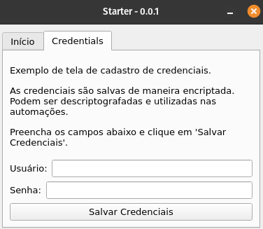

# pyqt5-starter


Projeto Starter Python QT5. Tem como objetivo fornecer um bom ponto de partida para projetos Python que necessitem de interface gráfica.

O foco deste projeto é a execução de automatizações WEB utilizando MVB (model-view-bot). Porém, pode ser modificado para qualquer funcionalidade.

## Sumário

1. [Requisitos](#requisitos)
1. [Organização do Projeto](#organização-do-projeto)
1. [Como Executar](#como-executar)
1. [Screenshots](#screenshots)

## Requisitos [:top:](#sumário)

1. Python 3.10.12

## Organização do projeto [:top:](#sumário)

```
.
├── requirements.txt
├── notebooks/
└── src/
    ├── app/
    └── interface/
    └── lib/
    └── automations/

```

1. `notebooks/ :` notebooks que foram utilizados para dar suporte ao desenvolvimento do projeto. Como versionar Jupyters é um pesadelo, modifique notebooks o mínimo possível, e caso necessite escrever mais código em notebooks, crie um novo.

1. `src/app/ :` funcionalidades _core_ do projeto, qual sejam: sua inicialização (**main.py**), o logger (**logger.py**) e informações globais (**common.py**)

1. `src/interface/ :` módulos que inicializam abas de exemplo para o projeto.

1. `src/lib/ :` oferece utilitários, como, por exemplo, a interface com o módulo de configurações com persistência e _retrieval_ de dados criptografados.

1. `src/automations: ` possui módulos auto-contidos de automatizações, utilizando o padrão MVB:
   - `model:` possui informações sobre os dados necessários para a execução das automatizações, bem como funções para o acesso, validação e processamento desses dados.
   - `view:` constrói a interface visual, instanciando componentes e inputs. Comunica-se com o **model** para solicitar a recuperação/modificação/validação dados, e com o **bot** para solicitar a execução de uma automação.
   - `bot:` define e executa as automações, puxando as informações necessárias para sua execução a partir do **model**.

## Como Executar [:top:](#sumário)

1. Crie um ambiente virtual para Python 3.10 utilizando o gerenciador de ambientes virtuais Python da sua escolha
1. Instale as dependências necessárias listadas no arquivo `requirements.txt`: `pip install -r requirements.txt`
1. Para rodar o projeto, execute-o como um pacote: `python3 -m src.app.main`

## Screenshots [:top:](#sumário)

### Linux

#### Aba de Credenciais


